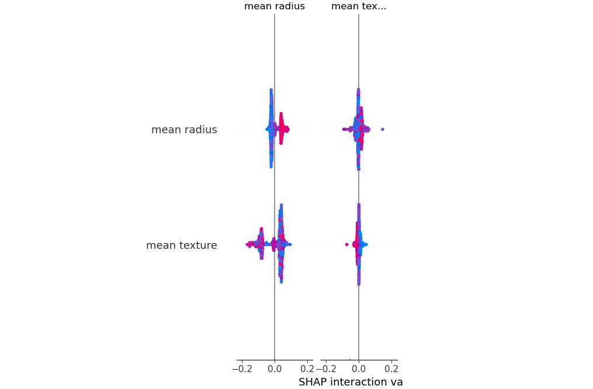
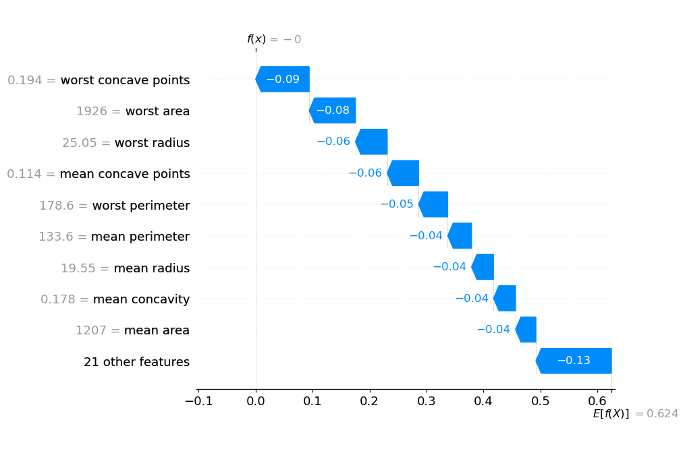

# 🧠 Explain My Model – Lightweight XAI Toolkit

> A lightweight, model-agnostic Explainable AI (XAI) toolkit to understand **why** machine learning models make specific predictions.

---

## 🚀 What This Project Does

**Explain My Model** helps you:
- Understand **which features matter most**
- Explain **individual predictions**
- Answer **“what needs to change to flip the prediction?”**
- Build **trustworthy and transparent ML systems**

Designed for:
- Machine Learning Engineers
- Researchers
- Healthcare & regulated ML use-cases

---

## ✨ Key Features

✅ Global feature importance (SHAP)  
✅ Local (instance-level) explanations  
✅ Human-readable explanation text  
✅ Counterfactual explanations (what-if analysis)  
✅ Works with `scikit-learn` compatible models  

---

## 📊 Dataset Used

**Breast Cancer Wisconsin Dataset**
- Healthcare tabular dataset
- Binary classification (benign vs malignant)
- 30 numerical features

Used to demonstrate **real-world explainability**.

---

## 🧩 Project Structure

explain-my-model/
│
├── explain_my_model/
│ ├── init.py
│ ├── explainer.py # Core XAI logic
│ └── utils.py
│
├── notebooks/
│ └── demo.ipynb # End-to-end demo
│
├── assets/ # Plots & screenshots
│
├── requirements.txt
├── README.md
└── .gitignore


---

## ⚙️ Installation

```bash
git clone https://github.com/<your-username>/explain-my-model.git
cd explain-my-model
pip install -r requirements.txt
```

▶️ Quick Start (Step-by-Step)

1️⃣ Train a model
```python
from sklearn.ensemble import RandomForestClassifier

model = RandomForestClassifier(random_state=42)
model.fit(X_train, y_train)
```

2️⃣ Initialize the Explainer
```python
from explain_my_model.explainer import Explainer

explainer = Explainer(model, X_train)
```

3️⃣ Global Explanation
Which features matter most overall?
```python
explainer.global_feature_importance()
```
📌 Output:
- Feature importance table
- SHAP summary plot

4️⃣ Local Explanation
Why did the model make THIS prediction?
```python
explainer.explain_instance(sample_instance)
```
📌 Output:
- Feature contribution table
- SHAP waterfall plot

5️⃣ Human-Readable Explanation
```python
print(explainer.explain_instance_text(sample_instance))
```
📌 Example output:
```bash
Top factors influencing the prediction:
- worst radius increased the risk
- mean texture increased the risk
- smoothness error decreased the risk
```

6️⃣ Counterfactual Explanation
What needs to change to flip the prediction?
```python
explainer.counterfactual(sample_instance)
```
📌 Output:
- Minimal feature changes required to alter the prediction

📈 Example Visuals
Global & Local Explanations
<p align="center">
  
  
</p>

🧪 Tech Stack
- Python
- scikit-learn
- SHAP
- pandas
- numpy
- matplotlib

🎯 Why This Project Matters

✔ Demonstrates Explainable AI (XAI) skills
✔ Shows responsible & transparent ML mindset
✔ Relevant to healthcare & regulated domains
✔ Strong signal for ML Engineer / Research roles

🚀 Future Extensions

- Deep learning explainability
- Fairness & bias analysis
- Medical imaging XAI
- Interactive dashboard (Streamlit)

📌 Author
Priyal Tailor
Machine Learning | Explainable AI | Healthcare ML

⭐ Support
If you find this project useful:
- Give it a ⭐
- Fork it
- Extend it with new XAI methods